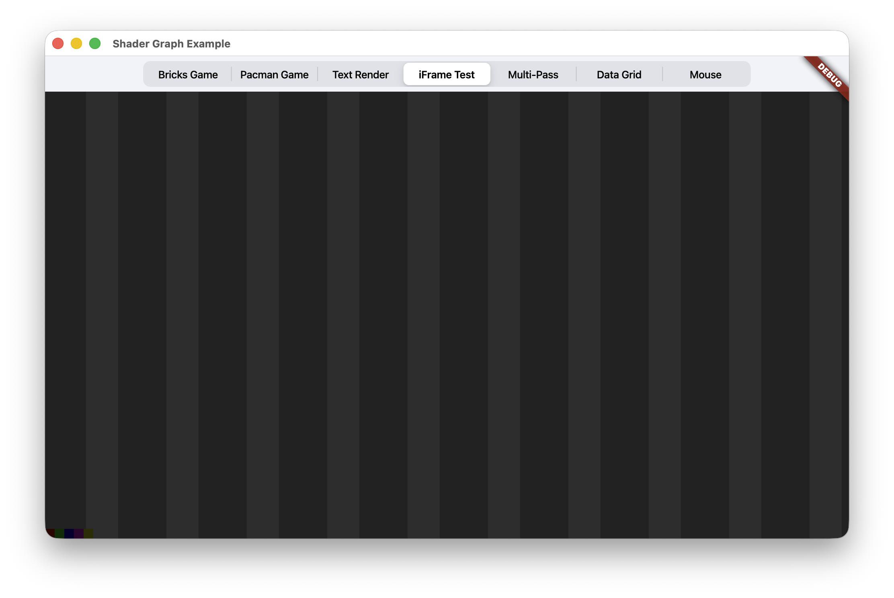
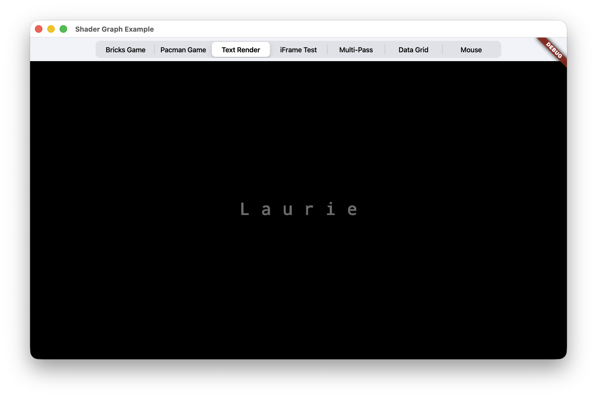

# Shader Graph

`shader_graph` 是一个面向 Flutter `FragmentProgram/RuntimeEffect` 的实时多 Pass Shader 执行框架

用“渲染图”的方式把多个 `.frag` 串起来跑（包含 Shadertoy 风格的 BufferA/BufferB/Main、feedback/ping-pong）

如果你只是想快速把一个着色器显示出来，可以直接用简单的 Widget 加载（例如 `ShaderSurfaceWrapper.buffer`）。

当你需要更复杂的链路（多 Pass / 多输入 / feedback / ping-pong）时，
再使用 `ShaderBuffer` 声明输入与依赖关系。
框架负责拓扑调度与逐帧执行，并把每个 pass 的输出作为 `ui.Image` 传给下游。

[English README](README.md) | 中文

## 截图

### 示例

|                                  |                                                  |                                          |
| -------------------------------- | ------------------------------------------------ | ---------------------------------------- |
|  |  |  |
| IFrame                           | Mac Wallpaper                                    | Noise Lab                                |
|      |                                                  |                                          |
| Text                             |                                                  |                                          |

### 游戏

|                                              |                                              |     |
| -------------------------------------------- | -------------------------------------------- | --- |
|  |  |     |
| Bricks Game                                  | Pacman Game                                  |     |

### Float

|                                            |     |     |
| ------------------------------------------ | --- | --- |
|  |     |     |
| Float Test                                 |     |     |


## Features

- [x] 支持将一个 Shader 作为 Buffer 然后输入到另一个 Shader(Multi-Pass)
- [x] 支持将图片作为 Buffer 输入到 Shader
- [x] 支持将自己作为 Buffer 输入给自己(Ping-Pong)
- [x] 支持鼠标事件
- [x] 自动拓扑排序
- [x] 有 Float 失真解决方案(需要编写额外的代码)
- [ ] 支持将 Widget 渲染成纹理，然后作为 Buffer 输入到 Shader

**Float 支持（RGBA8 feedback）**

Flutter 的 feedback 纹理通常是 RGBA8，无法稳定存储任意 float 状态。
本项目提供统一的移植方案 `sg_feedback_rgba8`：把标量编码进 RGB（24-bit），并通过横向 4-lane 打包保留 “一个 texel = vec4” 的语义。

## 前言

我以前对着色器的理解总是很模糊，朋友推荐我看 [The Book of Shaders](https://thebookofshaders.com/)，看了一部分，我总是不理解其中的原理，但我觉得 Shadertoy 上的着色器太有趣，有的甚至都是一个完整的游戏，这太疯狂啦，所以我想把它移植到 Flutter 上运行

就像这样，我们可以在 Flutter 中玩着色器实现的游戏了

首先感谢 [shader_buffers](https://github.com/alnitak/shader_buffers) 的作者，在最初可以让我将一些着色器代码移植到 Flutter

也正是因为在使用这个库的时候，发现了有些不足的地方，且与我希望的设计和原设计，有比较大的差别，其中的缺陷我均以提交 PR 的方式帮助修复

但仍然有比较多的问题，以及比较多的需要实现的需求，不仅是 shader_buffers，而是几乎所有的 Flutter 中存在的着色器框架都没有解决的问题

例如上面 Features 里面提到的

老实说，我手上正在维护的项目太多，其中很多我在乎的项目，都是半停更的状态

所以这个项目的实现，我借助了比较多的 AI 来完成这个项目，主要是 GPT5.2，也正是因为我做了比较大量的开源，每个月有一些免费的额度，我爱开源！

但是我尽量保证是我驱动它，而不是它驱动我，我对着色器相关很多都不太熟，这部分的代码实现几乎都是它完成的

我负责整理，编写 Prompt，虽然是它负责比较多，但其中的调试验证也花费了不少的精力

Dart 侧的设计几乎是完全按照我的想法

尽量保证
- 使用上的简洁、方便
- 保证功能的强大
- 设计上的合理
- 保证工程代码可读
- 大量的中英文注释，适合中国宝宝

## Usage

详细示例可以参考 [example](example/lib/main.dart)

### 最小可运行示例

**1) 单 shader（Widget）**
```dart
SizedBox(
  height: 240,
  child: ShaderSurfaceWrapper.buffer('shaders/frame/IFrame Test.frag'),
)
```

**2) 两个 pass（A → Main）**
```dart
ShaderSurfaceWrapper.builder(() {
  final a = 'shaders/multi_pass/MacOS Monterey wallpaper BufferA.frag'.shaderBuffer;
  final main = 'shaders/multi_pass/MacOS Monterey wallpaper.frag'
      .shaderBuffer
    ..feedShader(a);
  return [a, main];
})
```

**3) feedback（A → A，再接一个 Main 显示）**
```dart
ShaderSurfaceWrapper.builder(() {
  final a = 'shaders/game_ported/Bricks Game BufferA.frag'.shaderBuffer;
  a.fixedOutputSize = const Size(14 * 4.0, 14);
  a.feedback().feedKeyboard();

  final main = 'shaders/game_ported/Bricks Game.frag'.shaderBuffer
    ..feedShader(a);
  return [a, main];
})
```

首先 Shadertoy 的着色器代码，是需要移植到 Flutter，才能运行的，项目里面有辅助移植的 Prompt

### ShaderBuffer

它可以是最终渲染的着色器，也可以作为中间的一个 Buffer 喂给另一个着色器
```dart
final buffer = ShaderBuffer('$asset_path');
```

**添加另一个着色器作为输入**
```dart
buffer.feedShader(anotherBuffer);
buffer.feedShaderFromAsset("$asset_path");
```

**添加键盘事件作为输入**
```dart
buffer.feedKeyboard();
```

**添加资源图片作为输入**
> 通常用来输入噪声，但是目前还有问题，待解决

```dart
buffer.feedImageFromAsset('$noise_asset_path');
```

**Ping-Pong**
也就是自己给自己，不用担心死循环，shader_graph 做了适配，不会存在死循环

这也是 Shadertoy 上非常常见的的 Ping-Pong 反馈

```dart
buffer.feedback();
```

### ShaderSurfaceWrapper.buffer

如果你只有一个 frag 需要渲染，使用这个是最佳的选择

```dart
ShaderSurfaceWrapper.buffer('$shader_asset_path');
```
你可以把它放在任何地方，注意，通常需要告诉它高度

```dart
Column(
  children: [
    Text('This is a shader:'),
    ShaderSurfaceWrapper.buffer('$shader_asset_path'),
  ],
)
```

`ShaderSurfaceWrapper.buffer` 目前的第一个参数是字符串或者 ShaderBuffer
传入 ShaderBuffer，当 Shader 有输入的情况
> 我个人感觉从设计的角度上，有些不优雅，但是它更好用呀！！！

```dart
Builder(builder: (context) {
    final mainBuffer = ShaderBuffer('$shader_asset_path');
    mainBuffer.feedImageFromAsset('$noise_asset_path');
    return ShaderSurfaceWrapper.buffer(mainBuffer);
}),
```

### 使用 Extension
当多个 ShaderBuffer 都需要有输入的时候，就会变成这样
```dart
Column(
  children: [
    Text('This is a shader:'),
    Builder(builder: (context) {
        final mainBuffer = ShaderBuffer('$shader_asset_path');
        mainBuffer.feedImageFromAsset('$noise_asset_path');
        return ShaderSurfaceWrapper.buffer(mainBuffer);
    }),
    Builder(builder: (context) {
        final mainBuffer = ShaderBuffer('$shader_asset_path');
        mainBuffer.feedImageFromAsset('$noise_asset_path');
        return ShaderSurfaceWrapper.buffer(mainBuffer);
    }),
  ],
)
```

使用 Extension 经过优化可以变成这样
```dart
ShaderSurfaceWrapper.buffer(
    '$shader_asset_path'.shaderBuffer.feedImageFromAsset('$noise_asset_path'),
),
Column(
  children: [
    Text('This is a shader:'),
    ShaderSurfaceWrapper.buffer(
        '$shader_asset_path'.shaderBuffer.feedImageFromAsset('$noise_asset_path'),
    ),
    ShaderSurfaceWrapper.buffer(
        '$shader_asset_path'.shaderBuffer.feedImageFromAsset('$noise_asset_path'),
    ),
  ],
)
```
### ShaderSurfaceWrapper.builder

上面的例子都是只有一个着色器存在，或者链路是顺序的，例如
A->A A->B B->C 
但是如果是复杂的链路，例如
A->A A->B B->C A,B,C->D

ShaderSurfaceWrapper 提供了 builder 来应对这种情况，你可以像这个使用，这样可以不会使用多个 Builder(Flutter)
> Builder 不会消失，只是它转移了
```dart
return ShaderSurfaceWrapper.builder(
  () {
    final bufferA = 'shaders/game_ported/Bricks Game BufferA.frag'.feedback().feedKeyboard();
    final mainBuffer = 'shaders/game_ported/Bricks Game.frag'.feedShaderBuffer(bufferA);
    // Standard scheme: physical width = virtual * 4
    bufferA.fixedOutputSize = const Size(14 * 4.0, 14);

    return [bufferA, mainBuffer];
  },
);
```


## 拓扑排序
对于 Shadertoy 上的着色器，部分是可以拓扑排序的，注意，是最终的 Buffer 列表可以拓扑排序

对于单个 Buffer 的输入，需要按照 Shadertoy 上的定义顺序进行输入

因为他们都有一个完整的链路

也就是说，你最后交给给 shader_graph 的可以是 [A,B,C,D] 也可以是 [D,C,B,A]，诸如此类，都不会影响最后的效果

```dart
class PacmanGame extends StatefulWidget {
  const PacmanGame({super.key});

  @override
  State<PacmanGame> createState() => _PacmanGameState();
}

class _PacmanGameState extends State<PacmanGame> {
  late final List<int> _order;

  @override
  void initState() {
    super.initState();
    _order = [0, 1, 2]..shuffle(Random(DateTime.now().microsecondsSinceEpoch));
  }

  @override
  Widget build(BuildContext context) {
    return ShaderSurfaceWrapper.builder(
      () {
        final bufferA = 'shaders/game_ported/Pacman Game BufferA.frag'.shaderBuffer;
        final bufferB = 'shaders/game_ported/Pacman Game BufferB.frag'.shaderBuffer;
        final mainBuffer = 'shaders/game_ported/Pacman Game.frag'.shaderBuffer;
        bufferA.fixedOutputSize = const Size(32 * 4.0, 32);
        bufferA.feedback().feedKeyboard();
        bufferB.feedShader(bufferA);
        mainBuffer.feedShader(bufferA).feedShader(bufferB);

        final buffers = [bufferA, bufferB, mainBuffer];
        return _order.map((i) => buffers[i]).toList(growable: false);
      },
    );
  }
}
```

## toImageSync 内存泄露

[toImageSync retains display list which can lead to surprising memory retention](https://github.com/flutter/flutter/issues/138627)

这里之前踩过一个坑：在 Flutter 3.38.5（macOS）上，`toImageSync` 仍可能出现明显的内存占用增长。
我在本机测试时，应用运行一段时间会持续吃掉物理内存并开始占用 Swap，最终占用会变得非常夸张。

当前工程的规避方式：
- 改用异步的 `toImage()`（避免 `toImageSync` 的高风险路径）
- 但不能每一帧都触发一次转图，否则仍会造成巨大开销
- 因此用 Ticker/节流策略：只在“新的一帧 image 准备好”之后再触发下一次更新