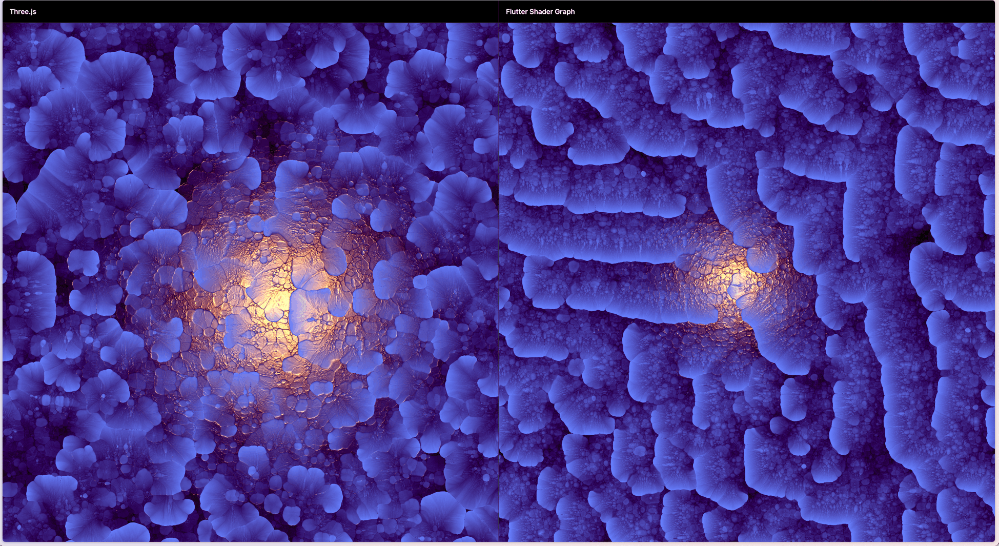

# Shader Graph

`shader_graph` 是一个面向 Flutter `FragmentProgram / RuntimeEffect` 的实时多 Pass Shader 执行框架。

它现在甚至可以运行一个**完全由着色器实现的游戏**。


该框架通过「渲染图（Render Graph）」的方式，将多个 `.frag` 串联执行，完整支持 Shadertoy 风格的 BufferA / BufferB / Main、feedback / ping-pong 等模型。

支持键盘输入、鼠标输入、图片输入，Widget 输入，并支持 Shadertoy 风格的 Wrap（Clamp / Repeat / Mirror）。

如果你只是想快速把一个着色器显示出来，可以直接使用简单的 Widget（例如 `ShaderSurface.auto`）。

当你需要更复杂的链路（多 Pass / 多输入 / feedback / ping-pong）时，再使用 `ShaderBuffer` 显式声明输入与依赖关系。

源码中则包含了大量中英文注释，方便阅读与理解。

请原谅，这个项目的文档，我并没有处理得很好，对于不了解着色器的朋友，这些文档简直是灾难级的，我只想尽可能的让他们变得简单，但一个库如果真的很强大，就必须要有一定的学习成本。

[English](README.md) | 中文

## 目录

- [Shader Graph](#shader-graph)
  - [目录](#目录)
  - [路线图](#路线图)
  - [快速开始](#快速开始)
    - [最小可运行示例](#最小可运行示例)
      - [1) 单 Shader（Widget）](#1-单-shaderwidget)
      - [2) 两个 Pass（A → Main）](#2-两个-passa--main)
      - [3) feedback（A → A → Main）](#3-feedbacka--a--main)
  - [前言](#前言)
    - [`shader_graph` 已经能支持很复杂的多 Pass 场景](#shader_graph-已经能支持很复杂的多-pass-场景)
    - [Float 支持（RGBA8 feedback）方案](#float-支持rgba8-feedback方案)
    - [texelFetch 支持](#texelfetch-支持)
  - [示例](#示例)
    - [示例截图](#示例截图)
    - [Ping-Pong \& Multi-Pass \& RGBA8 Feedback](#ping-pong--multi-pass--rgba8-feedback)
    - [Wrap \& Filter](#wrap--filter)
    - [键盘输入](#键盘输入)
    - [其他](#其他)
  - [ShaderBuffer](#shaderbuffer)
  - [ShaderBuffer.feed](#shaderbufferfeed)
    - [添加 Widget 作为输入](#添加-widget-作为输入)
    - [添加另一个着色器作为输入](#添加另一个着色器作为输入)
    - [添加键盘作为输入](#添加键盘作为输入)
    - [添加资源图片作为输入](#添加资源图片作为输入)
    - [feedback / ping-pong](#feedback--ping-pong)
    - [自定义 Uniform](#自定义-uniform)
    - [自定义输入](#自定义输入)
    - [Wrap（repeat / mirror / clamp）](#wraprepeat--mirror--clamp)
    - [设置输出尺寸（Output Size）](#设置输出尺寸output-size)
  - [ShaderSurface.auto](#shadersurfaceauto)
  - [ShaderSurface.builder](#shadersurfacebuilder)
  - [动画控制](#动画控制)
    - [基本用法](#基本用法)
    - [集成方式](#集成方式)
    - [行为说明](#行为说明)
  - [拓扑排序](#拓扑排序)
  - [toImageSync 内存泄露](#toimagesync-内存泄露)
  - [Copilot](#copilot)
  - [ShaderToy → Flutter 移植指南](#shadertoy--flutter-移植指南)


---

## 路线图

- [x] 将一个 Shader 作为 Buffer 输入到另一个 Shader（Multi-Pass）
- [x] 将 Widget 渲染为纹理，再作为 Buffer 输入
- [x] 将图片资源作为 Buffer 输入到 Shader
- [x] 反馈输入（Ping-Pong：上一帧 → 下一帧）
- [x] 鼠标事件 & 键盘事件
- [x] 自动拓扑排序
- [x] texelFetch（通过宏自动计算 texel 大小）
- [x] Shadertoy 风格的 Wrap（Clamp / Repeat / Mirror）
- [x] Shadertoy 风格的 Filter（Linear / Nearest / Mipmap）
  - [x] Nearest / Linear：已基本支持，存在轻微差异
  - [ ] Mipmap：暂不支持，正在探索 Flutter 中可落地的 mipmap-like 方案
- [x] 动画控制（ShaderController 提供播放/暂停功能）
- [x] 自定义 Uniform
- [ ] 摄像头输入 & 音频输入 & 音频输出方案(shader_graph后续本身不会集成这些东西，但会为这些功能提供一个可行的方案)

---

## 快速开始

首先需要明确一点：

**Shadertoy 的着色器代码必须经过移植，才能在 Flutter 中运行。**

**并且当前一定要配合项目 example/shaders/common 下的 common_header.frag/main_shadertoy.frag，不然无法实现 Wrap/Filter/texelFetch，如果需要支持 rgba8 feedback，也需要配合 sg_feedback_rgba8.frag**

> example/shaders/common 下文件的位置，我后面会思考一下，让他们看起来更重要一些，而不是在 example 目录下。

项目中提供了辅助移植的 Prompt：`port_shader.prompt.md`

基本流程如下：

1. 打开需要移植的着色器文件（建议直接放在项目中）
2. 在 Copilot 等 AI 工具中输入对应 Prompt

```text
Follow instructions in [port_shader.prompt.md](.github/prompts/port_shader.prompt.md).
```

---

### 最小可运行示例

#### 1) 单 Shader（Widget）

```dart
SizedBox(
  height: 240,
  // shader_asset_main ends with .frag
  child: ShaderSurface.auto('$shader_asset_main'),
)
```

#### 2) 两个 Pass（A → Main）

见 [multi_pass.dart](example/lib/multi_pass.dart)

```dart
ShaderSurface.builder(() {
  final bufferA = '$shader_asset_buffera'.shaderBuffer;
  final main = '$shader_asset_main'.shaderBuffer.feed(bufferA);
  return [bufferA, main];
})
```

#### 3) feedback（A → A → Main）

见 [bricks_game.dart](example/lib/game/bricks_game.dart)

```dart
ShaderSurface.builder(() {
  final bufferA = '$asset_shader_buffera'.feedback().feedKeyboard();
  final mainBuffer = '$asset_shader_main'.feed(bufferA);
  // Standard scheme: physical width = virtual * 4
  bufferA.fixedOutputSize = const Size(14 * 4.0, 14);
  return [bufferA, mainBuffer];
})
```

## 前言

我觉得 Shadertoy 上的着色器非常有趣，有些作品甚至本身就是一个完整的游戏，这让我产生了一个想法：

**能不能把这些着色器移植到 Flutter 上运行？**

首先要感谢 [shader_buffers](https://github.com/alnitak/shader_buffers) 这个项目，让我最初能够把一些 Shadertoy 的着色器代码移植到 Flutter 中运行。

但在实际使用过程中，我逐渐发现它在设计和功能上与我的需求存在较大差异。其中一部分问题，我已经通过提交 PR 的方式参与修复。

随着需求的不断增加，我意识到问题并不只存在于 shader_buffers，而是几乎所有 Flutter 现有的着色器框架都没有覆盖的一整类问题。

因此，`shader_graph` 诞生了。

### `shader_graph` 已经能支持很复杂的多 Pass 场景

ShaderToy 上很多炫酷的效果都是多个着色器和各种输入混合得到的结果，大部分的现有的 flutter 渲染 shader 的方案，基本都是单 Pass 的，很难实现这样的多 pass 反馈场景。

更不可能实现多 Pass + feedback + 循坏依赖 + Filter + Wrap 的完整 Shadertoy 风格。

以这个着色器为例：[expansive reaction-diffusion](https://www.shadertoy.com/view/4dcGW2)

详细的依赖图如下:

```text
     ┌─────┐                  ┌───────┐
  ┌──|     |◀─────────────────| Noise | 
  |  |  A  |◀────────────┐    └───┬───┘ 
  └─▶│     │◀──────┐     |        |     
     └─┬─┬─┘       │     |        |     
  ┌────┘ │         │     |        |     
  |      ▼         │     |        |     
  |   ┌─────┐    ┌─┴─┐   |        |     
  |   │  B  │    | D |   |        |
  |   └──┬──┘    └───┘   |        |     
  |      ▼               |        |     
  |   ┌─────┐            |        |     
  |   │  C  │────────────┘        |     
  |   └──┬──┘                     │     
  |      └──────┐                 |
  |             ▼                 |
  |      ┌─────────────┐          |
  └─────▶│    Image    │◀─────────┘
         └─────────────┘
```

A 依赖自身上一帧的输入，C 依赖 A 的上一帧输入，而 A 又依赖 C 的上一帧输入，形成了一个跨帧的循环依赖，目前也能解决了。

> 效果有些微的不一致，也许等 flutter impeller 支持更多的 sampler 特性后，能更好地还原，特别是 texelFetch，filter/wrap 等。

并且我创建了一个 Three.js 的版本，用于对比二者差异

使用 Three.js 版本：<https://nightmare-space.github.io/shader_graph/three.js.html>
使用 Flutter(ShaderGraph) 版本：<https://nightmare-space.github.io/shader_graph?example=ReactionDiffusion>
二者对比：<https://nightmare-space.github.io/shader_graph/combined.html>



---

### Float 支持（RGBA8 feedback）方案

Flutter 的 feedback 纹理通常为 RGBA8，无法稳定存储任意 float 状态。

本项目提供统一的移植方案 `sg_feedback_rgba8`：  
将标量编码进 RGB（24-bit），并通过横向 4-lane 打包，保留“一个 texel = vec4”的语义。

---

### texelFetch 支持

通过 `common_header.frag` 提供的：

- `SG_TEXELFETCH`
- `SG_TEXELFETCH0..3`

宏替代原生 `texelFetch` 调用，并使用 `iChannelResolution0..3` 自动获得通道分辨率，注意，这仍然可能受到 Flutter 本身的 Filter 干扰。

---

## 示例

我已经使用该库创建了 [awesome_flutter_shaders](https://github.com/nightmare-space/awesome_flutter_shaders) 项目。

这是目前最完整的示例集合，包含 **100+ 个 Shadertoy 着色器的 Flutter 移植示例**，非常推荐直接参考。

包括上下面截图展示的是当前项目的 [example](example/lib/main.dart)，也包含了针对各个功能点的示例

更不错的是，shader_graph 的 example 和大部分的 awesome_flutter_shaders 中的着色器都支持 flutter web。

可以访问在线示例，感受着色器的魅力，以及使用这个库，能获得什么样的效果

- [shader_graph example web](https://nightmare-space.github.io/shader_graph)
- [awesome_flutter_shaders web](https://nightmare-space.github.io/awesome_flutter_shaders)

---

### 示例截图

### Ping-Pong & Multi-Pass & RGBA8 Feedback

<table>
  <tr>
    <td>
      
      <br>
      Bricks Game
    </td>
    <td>
      
      <br>
      Pacman Game
    </td>
  </tr>
</table>

---

### Wrap & Filter

以下示例展示了 Wrap / Filter 对着色器效果的决定性影响。如果不支持这些特性，画面效果会与 Shadertoy 存在明显差异。

<table>
  <tr>
    <td>
      
      <br>
      Raw Image
    </td>
    <td>
      
      <br>
      Transition Burning
    </td>
    <td>
      
      <br>
      Tissue
    </td>
  </tr>
</table>

<table>
  <tr>
    <td>
      
      <br>
      Black Hole
    </td>
    <td>
      
      <br>
      Broken Time Gate
    </td>
    <td>
      
      <br>
      Goodbye Dream Clouds
    </td>
  </tr>
</table>

### 键盘输入

> 注意：这些画面并非 Flutter UI，而是完全由着色器渲染，并且可以实时响应键盘输入


### 其他

<table>
  <tr>
    <td>
      
      <br>
      IFrame
    </td>
    <td>
      
      <br>
      Noise Lab
    </td>
    <td>
    </td>
  </tr>
  <tr>
    <td>
      
      <br>
      Text
    </td>
    <td>
      
      <br>
      Float Test
    </td>
  </tr>
</table>

---

## ShaderBuffer

`ShaderBuffer` 既可以作为最终渲染的着色器，也可以作为中间 `Buffer` 输入到其他着色器。

是构建 Widget `ShaderSurface` 的核心组件。

通常通过 extension 创建：

```dart
'$asset_path'.shaderBuffer;
```

它等价于

```dart
final buffer = ShaderBuffer('$asset_path');
```

`ShaderBuffer` 可以配合以下 API 使用

- `ShaderSurface.auto`: 自动判断输入类型
- `ShaderSurface.builder`: 适合复杂多 Pass 场景，builer 最终调用 buffers，但 builder 提供函数回调，可以供开发者优化 Widget 代码结构

```dart
// path ends with .frag
final buffer = '$shader_asset_path'.shaderBuffer;
ShaderSurface.auto(buffer);
final shader_asset_path = '$shader_asset_path';
ShaderSurface.auto(shader_asset_path);
ShaderSurface.builder(() {
  // ...
  return [bufferA, bufferB, mainBuffer];
});
ShaderSurface(buffers: [bufferA, bufferB, mainBuffer]);
```

## ShaderBuffer.feed

ShaderBuffer 支持多种输入源，用于模拟 Shadertoy 中的 iChannel 行为。

目前支持的输入类型包括：

- 其他 ShaderBuffer
- 图片（ui.Image / Asset
- Widget
- 键盘输入
- 鼠标输入  
- 时间 / 分辨率等内置 Uniform  

`ShaderBuffer.feed` 用于将**一个输入源**绑定到当前的 `ShaderBuffer`。通过传入的类型来最终调用，如果是字符串，则会根据字符串结尾来判断

- `feedWidgetInput(Widget)`
- `feedShader(ShaderBuffer)`
- `feedShaderFromAsset(String)`
- `feedImageFromAsset(String)`

当然，你也可以直接调用原始的 API

### 添加 Widget 作为输入

```dart
final imageWidget = Text('Hello Flutter ShaderGraph!');
buffer.feed(imageWidget);
```

### 添加另一个着色器作为输入

```dart
final otherBuffer = '$other_shader_asset_path'.shaderBuffer;
buffer.feed(otherBuffer);
// or
final otherBuffer = ShaderBuffer('$other_shader_asset_path');
buffer.feedShader(otherBuffer);
```

### 添加键盘作为输入

```dart
buffer.feedKeyboard();
```

### 添加资源图片作为输入

> 通常用来输入噪声、纹理等

这部分可以参考  
[awesome_flutter_shaders](https://github.com/mengyanshou/awesome_flutter_shaders/tree/main/assets)

```dart
// path ends with .png/.jpg/...，not .frag
buffer.feed('$image_asset_path');
```

你可以连续调用 `feed`，为当前 `ShaderBuffer` 绑定多个输入，从而构建更复杂的依赖关系。

> 注意这个顺序要和 Shadertoy 定义的 iChannel 顺序一致。

```dart
final imageWidget = Image.asset('$image_asset_path');
final buffer = '$shader_asset_path'.shaderBuffer
  // path ends with .frag
  // will call feedShaderFromAsset
  .feed('$texture_asset_path1')
  // path ends with .png/.jpg
  // will call feedImageFromAsset
  .feed('$texture_asset_path2')
  // will call feedWidgetInput
  .feed(imageWidget)
  .feedback()
  .feedKeyboard();
```

### feedback / ping-pong

在 Shadertoy 中，feedback 是一个非常常见的模式，例如：

- 粒子模拟  
- 流体模拟  
- 细胞自动机  
- 完全由 Shader 驱动的游戏逻辑

```dart
final bufferA = '$asset_shader_buffera'.feedback();
```

启用 feedback 后：

- 当前帧的输入中，会包含上一帧的输出  
- 框架内部会自动维护双缓冲（ping-pong）  
- 使用者无需手动管理纹理交换  

你也可以在 feedback 的同时，继续喂入其他输入：

```dart
final bufferA =
  '$asset_shader_buffera'
    .shaderBuffer
    .feedback()
    .feedKeyboard();
```

### 自定义 Uniform

例如对于着色器：

```frag
#include <common/common_header.frag>

uniform float liftStrength;
uniform float liftRadius;
uniform float pointsPerRow;
uniform float baseDotOpacity;
uniform float swapProgress;

uniform vec4 iMouse1;
uniform vec4 iMouse2;
uniform vec4 iMouse3;
uniform vec4 iMouse4;

void mainImage( out vec4 fragColor, in vec2 fragCoord )
{
  /// Shader logic here
}

#include <common/main_shadertoy.frag>

```

Dart 代码：

```dart
buffer.setUniform(0, 0.0); // liftStrength
buffer.setUniform(1, 0.2); // liftRadius
buffer.setUniform(2, 24.0); // pointsPerRow
buffer.setUniform(3, 0.2); // baseDotOpacity
buffer.setUniform(4, 0.0); // swapProgress

// iMouse1-4
for (int i = 0; i < 4; i++) {
  buffer.setUniform(5 + i, [-1.0, -1.0, -1.0, -1.0]);
}
```

你可以随时更改某个 uniform 的值：

```dart
AnimationController controller = AnimationController(
  vsync: this,
  duration: const Duration(milliseconds: 100),
);
controller.addListener(() {
  buffer.setUniform(0, controller.value);
});
```

不需要手动调用 setState()，框架会在下一帧自动将新的 uniform 传递给着色器

### 自定义输入

目前自定义空间有限，且没有合适的回调开发者更新的时机，但如果实现一个 `ShaderInput`，仍然可以实现自定义输入源。例如相机的输出流、音频流等，后续可能会实现

```dart
abstract class ShaderInput {
  Image? resolve();

  /// UV wrap semantics expected by the shader.
  ///
  /// Defaults to clamp for compatibility.
  WrapMode get wrap => WrapMode.clamp;

  /// Filter semantics expected by the shader.
  ///
  /// Defaults to linear for compatibility.
  FilterMode get filter => FilterMode.linear;
}
```

---

### Wrap（repeat / mirror / clamp）

Flutter Runtime Shader 不直接暴露 sampler 的 wrap / filter 状态。

本项目通过 `iChannelWrap` uniform，并在 shader 内部进行 UV 变换来模拟 Wrap 行为。

在 Dart 侧为每个输入设置 wrap：

```dart
final buffer = '$shader_asset_path'.shaderBuffer;
buffer.feed('$texture_asset_path', wrap: WrapMode.repeat);
```

在 shader 侧采样时，**必须**使用 `common_header.frag` 提供的宏：

- `SG_TEX0`
- `SG_TEX1`
- `SG_TEX2`
- `SG_TEX3`

不要直接使用 `texture(iChannelN, uv)`。

---

### 设置输出尺寸（Output Size）

默认情况下，每个 ShaderBuffer 的输出尺寸等同于最终 Widget 的尺寸。

但在一些场景中，你可能希望：

- 使用更低分辨率进行计算（性能优化）  
- 使用固定逻辑分辨率（例如像素风游戏）  
- 明确控制 feedback Buffer 的尺寸  

此时可以显式指定输出尺寸：

```dart
buffer.fixedOutputSize = const Size(64, 64);
```

在游戏示例中，常见的做法是：

- 使用逻辑分辨率（如 14×14）
- 物理输出尺寸 = 逻辑宽度 × 4（RGBA8 feedback）

---

## ShaderSurface.auto

`ShaderSurface.auto` 返回一个 Widget，可直接用于展示 Shader。

> 当然你也可以直接使用 ShaderSurface(buffers: [...])，但 auto 更加方便。

```dart
Center(
  child: ShaderSurface.auto('$shader_asset_path'),
)
```

你可以把它放在任意 Widget 树中，通常需要给它一个高度约束：

```dart
Column(
  children: [
    Text('This is a shader:'),
    Expanded(
      child: ShaderSurface.auto('$shader_asset_path'),
    ),
  ],
)
```

`ShaderSurface.auto` 支持传入：

- String（shader 资源路径）  
- ShaderBuffer  
- List\<ShaderBuffer>  

当 Shader 存在输入时，直接传入 ShaderBuffer 更合适。

```dart
Builder(builder: (context) {
  final mainBuffer = '$shader_asset_path'.shaderBuffer;
  mainBuffer.feed('$noise_asset_path');
  return ShaderSurface.auto(mainBuffer);
}),
```

或者使用 extension

```dart
ShaderSurface.auto(
  '$shader_asset_path'.shaderBuffer.feed('$noise_asset_path'),
);
```

例如当多个 ShaderBuffer 都需要有输入的时候，就会变成这样

```dart
Column(
  children: [
    Text('This is a shader:'),
    Builder(builder: (context) {
        final mainBuffer = ShaderBuffer('$shader_asset_path');
        mainBuffer.feedImageFromAsset('$noise_asset_path');
        return ShaderSurface.auto(mainBuffer);
    }),
    Builder(builder: (context) {
        final mainBuffer = ShaderBuffer('$shader_asset_path');
        mainBuffer.feedImageFromAsset('$noise_asset_path');
        return ShaderSurface.auto(mainBuffer);
    }),
  ],
)
```

使用 Extension 经过优化可以变成这样

```dart
Column(
  children: [
    Text('This is a shader:'),
    ShaderSurface.auto(
      '$shader_asset_path'.feed('$noise_asset_path'),
    ),
    ShaderSurface.auto(
      '$shader_asset_path'.feed('$noise_asset_path'),
    ),
  ],
)
```

## ShaderSurface.builder

当存在复杂的多 Pass 依赖关系时，应使用 `ShaderSurface.builder`。

例如

```text
┌─────┐    ┌─────┐    ┌────────┐
│  A  │───▶│  B  │───▶│  Main  │
│ ↺ A │    └─────┘    └────────┘
└─────┘
```

这种多 Pass 场景下，`ShaderSurface.builder` 提供了一个回调函数，允许你在其中创建和配置多个 `ShaderBuffer`，并返回它们的列表。

```dart
ShaderSurface.builder(() {
  final bufferA = '$asset_shader_buffera'.feedback();
  final bufferB = '$asset_shader_bufferb'.feed(bufferA);
  final mainBuffer = '$asset_shader_main'.feed(bufferB);
  return [bufferA, bufferB, mainBuffer];
})
```

## 动画控制

ShaderController 为着色器动画提供简单的播放/暂停功能。

### 基本用法

```dart
// 创建控制器
final controller = ShaderController();

// 与 ShaderSurface 一起使用
ShaderSurface.auto(
  'shaders/wrap/Transition Burning.frag',
  shaderController: controller,
);

// 控制播放状态
controller.pause();   // 暂停动画
controller.resume();  // 恢复动画  
controller.toggle();  // 切换播放/暂停状态

// 检查当前状态
bool isPaused = controller.isPaused;
```

### 集成方式

ShaderController 可以传递给所有 ShaderSurface 工厂方法：

```dart
// 与 ShaderSurface.auto 一起使用
ShaderSurface.auto(
  'shaders/example.frag',
  shaderController: controller,
);

// 与 ShaderSurface.builder 一起使用  
ShaderSurface.builder(
  () {
    final bufferA = 'shaders/BufferA.frag'.shaderBuffer.feedback();
    final main = 'shaders/Main.frag'.shaderBuffer.feed(bufferA);
    return [bufferA, main];
  },
  shaderController: controller,
);

```

### 行为说明

- 暂停时：时间停止前进，但渲染继续使用最后的时间值
- 恢复时：时间从暂停的位置继续
- 控制器由 ShaderSurface 的生命周期自动管理

## 拓扑排序

对于 Shadertoy 风格的多 pass，只有当同一帧内的依赖关系不形成环（DAG）时，最终的 Buffer 列表才可以被拓扑排序。

也就是说：

- 每个 pass 只能读取它依赖的其它 pass 的输出（或外部输入）  
- 不能在同一帧出现循环依赖（例如 A 读 B，同时 B 读 A）  

feedback / ping-pong 读取的是上一帧的输出，属于跨帧依赖，通常不会破坏当前帧的拓扑排序。

注意：  
单个 Buffer 内部的输入通道顺序（iChannel0..N）仍必须严格按照 Shadertoy 的定义顺序 feed，因为 shader 侧采样是按通道顺序绑定的。

---

见 [pacman_game.dart](example/lib/game/pacman_game.dart)

```dart
class PacmanGame extends StatefulWidget {
  const PacmanGame({super.key});

  @override
  State<PacmanGame> createState() => _PacmanGameState();
}

class _PacmanGameState extends State<PacmanGame> {
  late final List<int> _order;

  @override
  void initState() {
    super.initState();
    _order = [0, 1, 2]..shuffle(Random(DateTime.now().microsecondsSinceEpoch));
  }

  @override
  Widget build(BuildContext context) {
    return ShaderSurface.builder(
      () {
        final bufferA = 'shaders/game_ported/Pacman Game BufferA.frag'.shaderBuffer;
        final bufferB = 'shaders/game_ported/Pacman Game BufferB.frag'.shaderBuffer;
        final mainBuffer = 'shaders/game_ported/Pacman Game.frag'.shaderBuffer;
        bufferA.fixedOutputSize = const Size(32 * 4.0, 32);
        bufferA.feedback().feedKeyboard();
        bufferB.feedShader(bufferA);
        mainBuffer.feedShader(bufferA).feedShader(bufferB);

        final buffers = [bufferA, bufferB, mainBuffer];
        return _order.map((i) => buffers[i]).toList(growable: false);
      },
    );
  }
}
```

## toImageSync 内存泄露

[toImageSync retains display list which can lead to surprising memory retention](https://github.com/flutter/flutter/issues/138627)

这里之前踩过一个坑：在 Flutter 3.38.5（macOS）上，`toImageSync` 仍可能出现明显的内存占用增长。
我在本机测试时，应用运行一段时间会持续吃掉物理内存并开始占用 Swap，最终占用会变得非常夸张。（超过200GB）

当前工程的规避方式：

- 改用异步的 `toImage()`（避免 `toImageSync` 的高风险路径）
- 但不能每一帧都触发一次转图，否则仍会造成巨大开销
- 因此用 Ticker/节流策略：只在“新的一帧 image 准备好”之后再触发下一次更新

## Copilot

老实说，我手上正在维护的项目很多，其中不少我在乎的项目都处于半停更状态。

因此这个项目的实现过程中，我借助了比较多的 AI（主要是 GPT-5.2）。

但整体设计、结构决策、调试与验证，仍然是由我主导完成的。

着色器相关的很多内容我并不熟悉，这部分的代码实现几乎都是 AI 完成的，调试与验证同样消耗了我大量精力。

Dart 侧的整体设计，几乎完全按照我的想法来推进。

目标始终是：

- 使用简单、直观  
- 功能足够强  
- 设计结构清晰  
- 工程代码可读  
- 大量中英文注释，适合学习与二次开发

---

## ShaderToy → Flutter 移植指南

关于将 Shadertoy 着色器移植到 Flutter 的详细信息，包括反馈机制、环绕模式和 RGBA8 反馈规范，请参阅 [DEVELOP.zh.md](DEVELOP.zh.md)。

本指南涵盖：

- 环绕模式（repeat/mirror/clamp）和着色器端采样
- 用于状态机的 RGBA8 反馈编码
- `texelFetch` 替换
- 着色器文件结构和 SkSL 不兼容性
- Dart 端多-pass 连接
- 故障排除清单
